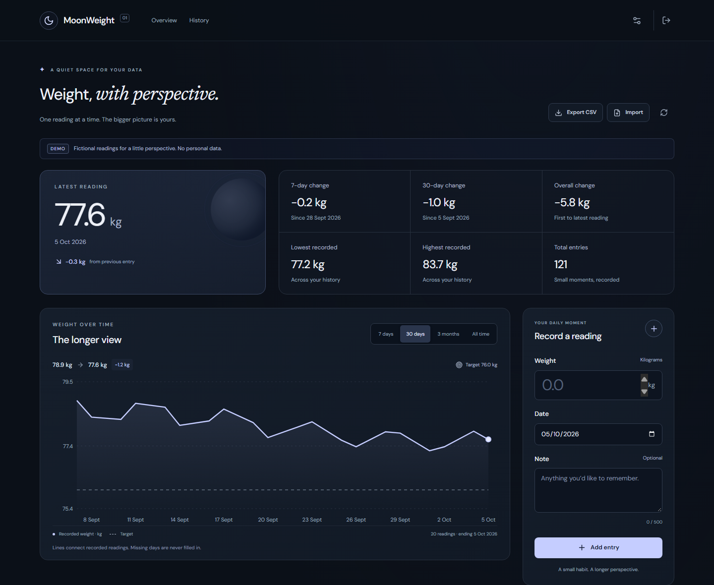
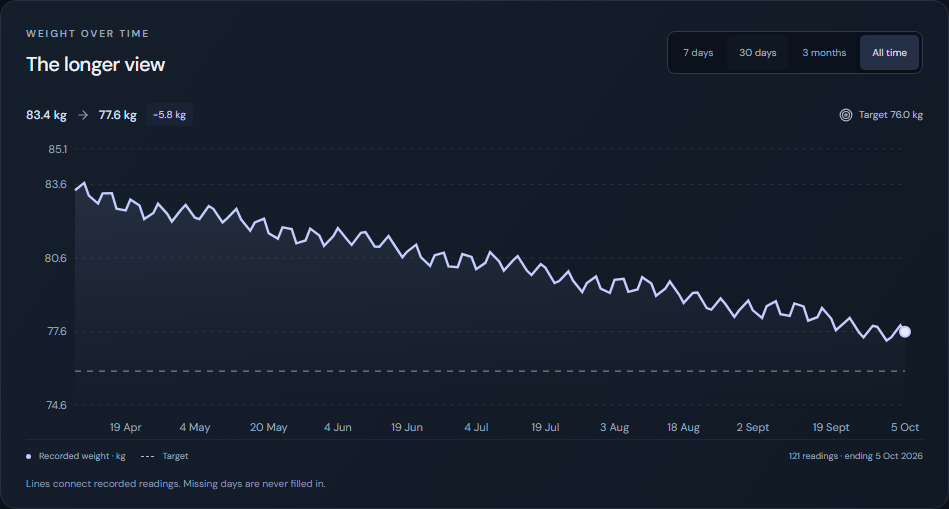
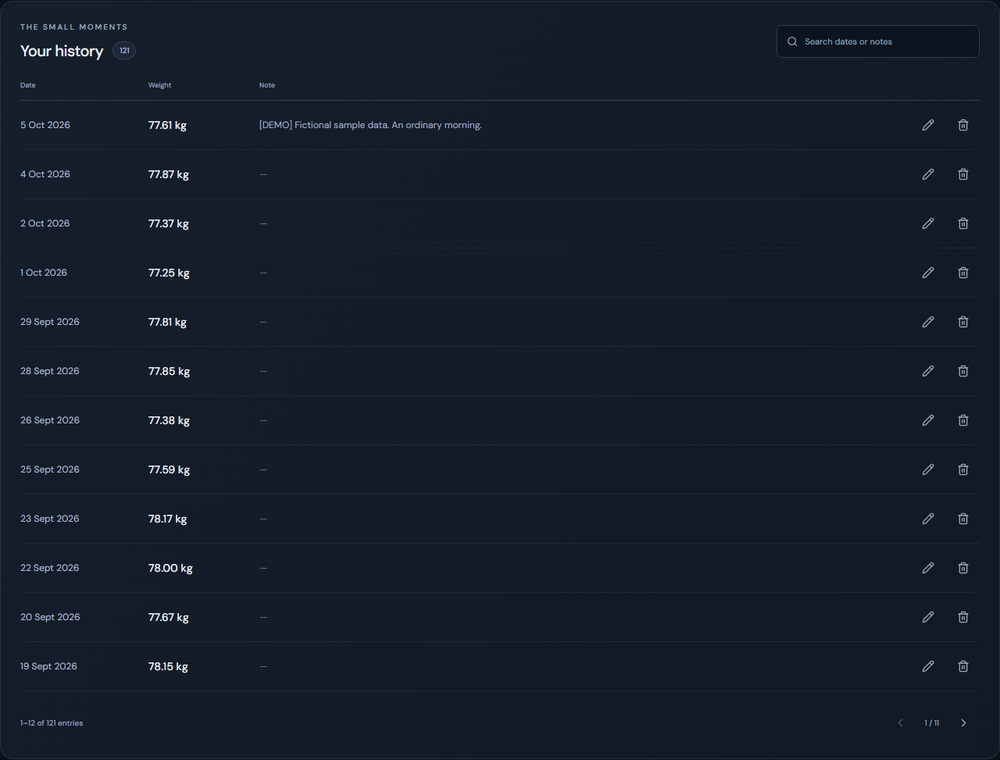
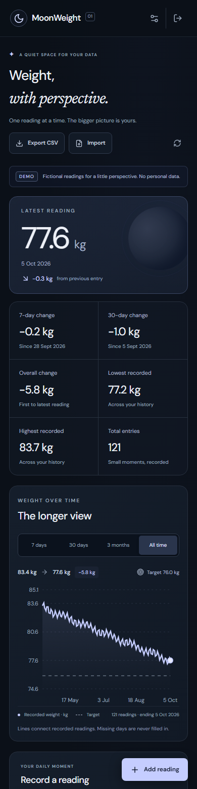
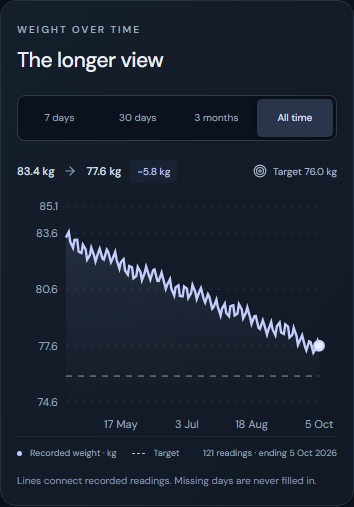
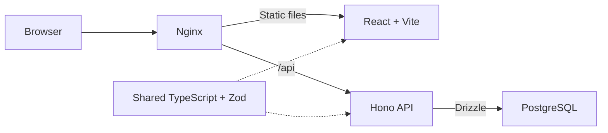

# MoonWeight

A quiet, private place to record your weight and see it over time. Self-hosted, simple, and always yours.

A complete TypeScript product: React and a time-scaled chart in the browser, a cookie-authenticated Hono API, shared validation, PostgreSQL persistence, and a tested Docker deployment.



**Try it locally:** copy `.env.example` to `.env`, configure the three secrets, then run `docker compose up --build -d`. Open [localhost:8080](http://localhost:8080). [Development instructions](#local-development) are below.

## Why I built it

I wanted a private, self-hosted tracker rather than relying on a third-party service. MoonWeight was also an opportunity to build the complete product, from its everyday interface and data model to authentication, testing, and deployment.

## Features

- Add, edit, delete, search, and page through readings with optional notes.
- Latest weight, previous change, 7/30-day comparisons, minimum, maximum, entry count, and overall change.
- A chart with 7-day, 30-day, three-calendar-month, and all-time views, precise tooltips, and an optional target line.
- Kilogram or pound display; canonical kilogram storage keeps unit switching safe.
- CSV export and validated import with a preview, rejected-row explanations, and duplicate skipping.
- One private account, HTTP-only cookies, persistent sessions, and real logout revocation.
- Responsive dark interface, keyboard-friendly dialogs, visible focus, and reduced-motion support.
- Fictional demo seeding and reproducible portfolio screenshots.

MoonWeight records and visualizes data. It does not make health recommendations.

## Screenshots

Every screenshot uses fictional data generated by `npm run demo:seed`.

| The longer view                                                | History                                           |
| -------------------------------------------------------------- | ------------------------------------------------- |
|  |  |

<p>
  
  
</p>

[Edit flow](docs/portfolio/edit-reading.png) · [Sign-in screen](docs/portfolio/login.png) · [Portfolio notes and demo flow](docs/portfolio/README.md)

## Architecture



| Directory         | Responsibility                                                             |
| ----------------- | -------------------------------------------------------------------------- |
| `apps/web`        | React UI, responsive chart, forms, dialogs, API client                     |
| `apps/api`        | Hono routes, auth, repositories, Drizzle schema, SQL migrations            |
| `packages/shared` | Validation, types, units, date/range logic, stats, CSV contracts           |
| `tests`           | Shared/API/component tests, isolated PostgreSQL tests, browser smoke tests |
| `docs/portfolio`  | Real screenshots and project presentation material                         |

The frontend derives dashboard statistics from the same entry snapshot it renders. The API's `/api/stats` endpoint uses the same shared calculation, so there is one definition of each statistic.

## Tech stack

React 18 · TypeScript · Vite 7 · Tailwind CSS 4 · Recharts · Lucide · Hono · Node.js 22 · PostgreSQL 16 · Drizzle · Zod · Papa Parse · Docker Compose · Nginx · Vitest · Playwright

Fonts are bundled locally. The application uses no analytics or third-party runtime services.

## Local development

Requires **Node.js 22.12+**, npm 10+, and PostgreSQL (Docker Compose is the easiest option).

```sh
cp .env.example .env
# Configure POSTGRES_PASSWORD (16+ characters),
# ADMIN_PASSWORD (12+ characters), and SESSION_SECRET (32+ characters).
npm install
docker compose -f docker-compose.yml -f docker-compose.dev.yml up -d postgres
npm run dev
```

Open [localhost:5173](http://localhost:5173). Vite proxies `/api` to the local API on port 3001. The API loads the root `.env` and applies migrations before listening. Shared code, API code, and the frontend are watched together. Development servers bind to loopback.

If port 5432 is already in use, change `POSTGRES_PORT` in `.env` (for example, to 55432). The development Compose override publishes PostgreSQL on **127.0.0.1 only**.

To generate a random secret:

```sh
node -e "console.log(require('node:crypto').randomBytes(32).toString('hex'))"
```

Optional manual migration command: `npm run db:migrate`. Missing or example secrets are rejected with a configuration error. A custom local `DATABASE_URL` is supported; credentials in it must be URL-encoded. Otherwise the API builds the URL safely from `POSTGRES_*` values.

| Command                     | Purpose                                                             |
| --------------------------- | ------------------------------------------------------------------- |
| `npm run dev`               | Start the watched development app; migrate automatically            |
| `npm run typecheck`         | Check shared, API, frontend, scripts, and tests                     |
| `npm run test`              | Run tests without a database                                        |
| `npm run test:integration`  | Create a unique temporary PostgreSQL database, test, then remove it |
| `npm run test:e2e`          | Desktop/mobile browser smoke tests on a fictional demo tracker      |
| `npm run build`             | Build every workspace for production                                |
| `npm run demo:seed`         | Populate an empty tracker with fictional data                       |
| `npm run portfolio:capture` | Capture real screenshots from a fictional tracker                   |

## Docker deployment

```sh
cp .env.example .env
# Configure all three secrets.
docker compose up --build -d
docker compose ps
```

Open [localhost:8080](http://localhost:8080). The supplied configuration runs HTTP on loopback with `COOKIE_SECURE=false`. It is suitable for a local showcase.

For a public deployment:

1. Put an HTTPS reverse proxy in front of `127.0.0.1:8080`.
2. Set `CORS_ORIGIN=https://your-domain.example` and `COOKIE_SECURE=true`.
3. Keep `WEB_BIND_ADDRESS=127.0.0.1` when the HTTPS proxy runs on the same host.
4. Restart with `docker compose up --build -d`.

The API and PostgreSQL have no published production ports. PostgreSQL uses an internal data network and a named persistent volume. PostgreSQL readiness gates API startup; API readiness gates Nginx startup. The API runs as a non-root user, migrates automatically, and shuts down its database connections on termination.

```sh
docker compose logs -f
docker compose stop
docker compose up -d
```

Stopping, restarting, or recreating containers preserves readings, settings, and sessions. **Do not use `docker compose down -v` on a tracker you want to keep**: it removes its database volume.

Before upgrading an existing installation, take a PostgreSQL backup. The v1 migration preserves original timestamps in `recorded_at_legacy` and converts the active reading date to its UTC calendar date. The previous app did not store the originating timezone; review dates if you previously recorded from an extreme timezone. No entries are merged or deleted. Migrations are transactional, serialized, and checksum-checked.

See [operations and backup instructions](docs/OPERATIONS.md).

## Data rules and CSV

Reading dates are calendar dates (`YYYY-MM-DD`), without timezone conversions. One date may contain multiple readings; newest creation time wins for “latest”, with ID as a deterministic tie-breaker.

Weights are stored as decimal kilograms with three fractional digits. Accepted values are 0.1–1000 kg; notes are trimmed and limited to 500 characters. These are integrity bounds, not health guidance.

Chart ranges end at the latest recorded date. Three months means three calendar months, with month-end clamping. Points use a real time axis and only recorded readings. Lines connect readings; they do not create values on missing days.

7/30-day comparisons use the latest reading as the reference date. A baseline must fall on or before the cutoff, within three extra days for a week or seven extra days for a month. The actual baseline date is shown. A missing nearby baseline yields “—”; previous and overall changes require at least two readings. Increases and decreases use neutral colors.

CSV format is independent of your display unit:

```csv
date,weight_kg,note
2025-05-01,81.250,"[DEMO] Fictional morning, at home"
2025-05-03,81.100,
```

Use UTF-8, the exact header above, decimal points, and quoted notes when they contain commas, quotes, or newlines. Exports use CRLF line endings. Formula-like notes and leading apostrophes receive a reversible apostrophe escape to protect spreadsheet applications.

Imports accept up to **1 MB / 1,000 data rows**. The preview identifies invalid rows and exact duplicates (date + canonical weight + trimmed note). You explicitly import the ready rows; rejected rows are never saved. The server validates again and inserts atomically, rechecking duplicates against current data. Different readings on the same date are preserved. No import updates or deletes existing entries.

## Testing

```sh
npm run typecheck
npm run test
npm run build
npm audit
```

For real PostgreSQL integration tests, start the development database and run `npm run test:integration`. The runner needs CREATE DATABASE permission; it only removes the unique temporary database it created.

For browser tests, use a **separate, empty demo tracker**:

```sh
npm run demo:seed
npx playwright install chromium
npm run test:e2e
```

Playwright starts the development server if needed. The fixture guard rejects trackers whose notes include non-demo data. Tests cover login, create, refresh, edit, delete confirmation/cancel, logout, settings, chart ranges, CSV preview/import/export, load failure/retry, session expiry, and overflow at 360/768/1024/1920 pixels. Test entries and settings are cleaned up afterward. Traces are disabled to avoid recording passwords.

To test an already running Docker showcase, set `E2E_BASE_URL` to its origin. Its admin password must match the local `.env`.

GitHub Actions runs typecheck, tests, build, dependency audit, PostgreSQL integration, and Chromium smoke tests. The workflow is supplied; remote CI execution must be confirmed after pushing.

## Security model

MoonWeight has **one account**, configured by `ADMIN_PASSWORD`. It is designed for an owner-controlled server.

- Password comparison uses fixed-length HMAC digests and timing-safe comparison.
- Session cookies are HTTP-only, SameSite=Strict, scoped to `/`, and Secure when configured for HTTPS.
- Session tokens contain 256 bits of random entropy. Only keyed hashes are stored in PostgreSQL; expiry is 30 days.
- Logout revokes the database session. Changing the password or session secret invalidates existing tokens.
- Ten failed login requests trigger a 15-minute rolling limit. It is global to the single-user API process; a restart clears it.
- Writes require JSON, allowed browser origins, and a non-cross-site fetch context. CORS never permits wildcard origins.
- Every data route requires authentication, request bodies are bounded, IDs and payloads are validated, and errors do not expose database details.
- Nginx sends a restrictive content security policy; fonts and scripts are served locally.
- `.env`, test artifacts, local credentials, and database volumes are excluded from source control.

Public exposure requires HTTPS and a trusted proxy. Protect the server, environment file, and backups; the app does not encrypt data at rest or manage TLS itself. The login limiter is intentionally a single-process control. There is no multi-user or distributed-session infrastructure.

The working-tree README was sanitized to remove a personal deployment address. **Existing Git history was preserved; review it before publishing the repository.** No real health data is included in the demo or screenshots.

## Demo and portfolio

`npm run demo:seed` creates 121 deterministic fictional readings over six months, sample notes, and a 76 kg target. It refuses a tracker with existing readings or customized settings. Use a separate Compose project/database for demos.

Docker demo seed (on an empty deployment):

```sh
docker compose exec api node dist/demo-seed.js
```

With a demo tracker running and Chromium installed, `npm run portfolio:capture` writes the seven real screenshots shown above. It refuses non-demo notes and saves no browser session file.

[Portfolio description, engineering decisions, screenshot checklist, and 25-second demo](docs/portfolio/README.md) · [v1.0 release report](V1_RELEASE.md)

## Roadmap

Optional after v1.0: an explicitly labeled statistical trend overlay and a light theme. No additional health-tracking scope is planned.
