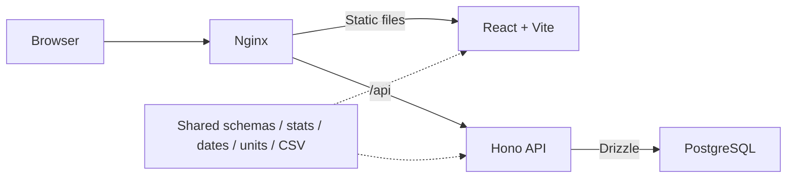

# MoonWeight v1.0.0 release report

Verified locally on 5 October 2026. The v1 product is implemented and ready for a reviewed release commit. Public publication still requires the historical-privacy review below.

## 1. Completed

- Preserved the React/Vite, Hono, Drizzle/PostgreSQL, shared TypeScript, Docker/Nginx architecture.
- Finished the calm lunar visual system, responsive dashboard, time-scaled chart, readable history, search/pagination, and accessible native dialogs.
- Completed add/edit/delete/note flows, sensible deletion confirmation, keyboard focus/restoration, session expiry, and loading/success/error/retry/empty states.
- Implemented all eight requested statistics with deterministic same-day ordering, precise canonical deltas, actual baseline dates, and unavailable states for unsupported sparse comparisons.
- Added persistent optional target and kg/lb preferences. Display changes never rewrite historical weights; note-only edits and target unit changes preserve canonical precision.
- Implemented documented CSV export and robust preview/import, including rejected-row reports, spreadsheet formula escaping, duplicate skipping, bounded requests, repeated backend validation, and atomic insertion.
- Replaced stateless signed cookies with random, hashed PostgreSQL sessions: actual revocation on logout, expiration, password/secret rotation, and restart persistence.
- Hardened origins, JSON-only writes, request sizes, UUID/payload validation, configuration defaults, errors, cookie flags, database isolation, and production CSP.
- Added locked, transactional, checksum-checked migrations, retaining original timestamps during the calendar-date upgrade.
- Repaired clean-install typechecking, root environment loading, shared package watching, local port handling, API startup/migration, graceful shutdown, Docker health/dependency ordering, and workspace dependency packaging.
- Updated vulnerable dependencies, including Vite 7 and Tailwind CSS 4, without changing the architecture. The final npm audit reports zero vulnerabilities.
- Added automated tests, a GitHub Actions workflow, consistent formatting, an empty-only fictional seed, professional README/operations docs, a portfolio kit, and seven real screenshots.
- Set all package versions and shared workspace references to **1.0.0**.

No v1.1 features were implemented.

## 2. Architecture summary



PostgreSQL persists readings, singleton preferences, and hashed sessions. Reading dates use DATE; audit timestamps remain actual instants. Weight storage is NUMERIC(7,3) in kilograms. Multiple readings per day remain supported. The frontend renders stats from its entry snapshot using the same shared function as the stats API.

Production exposes only the loopback-bound web port. The API runs as a non-root user. PostgreSQL has no published port and uses an internal network. An external HTTPS proxy is required for public hosting.

## 3. Commands and checks executed

| Command / check                                     | Result                                                                                                                 |
| --------------------------------------------------- | ---------------------------------------------------------------------------------------------------------------------- |
| Baseline npm ci, typecheck, build                   | Install/build ran; fresh typecheck exposed the missing shared-output dependency                                        |
| npm install in a source-only copy                   | Passed without copied .env, node_modules, or dist                                                                      |
| npm run dev                                         | Running frontend, watched shared package, and automatically migrated API                                               |
| npm run typecheck                                   | Passed, including scripts and test TypeScript                                                                          |
| npm run test                                        | **61 passed**                                                                                                          |
| npm run test:integration                            | **8 passed** against real PostgreSQL in a newly created temporary database                                             |
| npm run build                                       | Passed for shared, API, and frontend                                                                                   |
| npm audit                                           | **0 vulnerabilities**                                                                                                  |
| npm run format:check                                | Passed                                                                                                                 |
| npm run test:e2e                                    | **8 passed**, desktop and 360px mobile                                                                                 |
| E2E_BASE_URL=http://localhost:8081 npm run test:e2e | **8 passed** through the production Nginx/API/PostgreSQL stack                                                         |
| Axe WCAG checks                                     | No violations on login, dashboard, and edit dialog in desktop/mobile Chromium                                          |
| Responsive browser checks                           | No horizontal overflow at 360, 768, 1024, and 1920px; long unbroken notes exercised                                    |
| Clean production Compose up --build -d              | Built from source, applied migrations, and reached healthy PostgreSQL/API/web states                                   |
| Compose restart                                     | Preserved an entry, target/unit settings, and the original active session; replay after logout was rejected            |
| Production port inspection                          | PostgreSQL has no published port; API stays internal                                                                   |
| Repeated/concurrent migrations                      | Passed; changed migration content was correctly rejected                                                               |
| pg_dump / pg_restore                                | Restored all 121 fictional readings into a separate database                                                           |
| Demo seed                                           | Created 121 fictional readings in an empty tracker; a second run refused to overwrite it                               |
| npm run portfolio:capture                           | Captured seven actual browser screenshots using fictional data                                                         |
| Working-tree privacy scan                           | No non-loopback infrastructure IPs, personal username, credential-token patterns, or committed environment files found |
| git diff --check                                    | Passed                                                                                                                 |

The temporary integration database is created and removed by the test runner. Browser tests create/delete their own fictional readings and restore preferences. Remote GitHub Actions has **not** been executed from this environment.

Two coherent deployment issues were found and fixed: npm placed Drizzle in the API workspace's node_modules, which must be included in the runtime image; and Docker does not publish development PostgreSQL ports on an internal network, so the development override explicitly relaxes that network while keeping loopback binding.

The checksum guard also caught a whitespace cleanup touching a migration. The already-applied migration file was restored exactly rather than changing database migration history.

## 4. Known limitations and assumptions

- **Publication privacy:** the working-tree README no longer contains the personal VPS address, but the original Git commit does. Git history was preserved as requested. Review/sanitize the history through a deliberate publication decision before making it public. The address is not repeated in release material.
- Public HTTPS termination, server/backup security, and secrets management remain the operator's responsibility. The application does not encrypt PostgreSQL data at rest.
- The login limiter is global, in-memory, and single-process; a restart clears it. This is intentional for a single-user server.
- Legacy timestamps cannot reveal their original local timezone. v1 retains them and uses their UTC date; owners in extreme timezones should review migrated dates.
- Browser automation used Chromium, including mobile emulation. Real iOS Safari, Firefox, hosted CI, and a public HTTPS deployment still need the manual checks below.
- Chart lines connect measured points. No smoothing, health inference, or missing-day interpolation is provided.

## 5. Intentionally deferred optional ideas

Only an explicitly labeled statistical trend overlay and a light theme remain optional future ideas. CSV import is complete in v1. No multi-user, diet, coaching, medical, social, or notification scope was added.

## 6. Manual verification before publication

1. Review the release diff and the original Git history for the removed deployment address. Keep .env, backups, cookies, and personal data private.
2. On your actual HTTPS host, verify CORS_ORIGIN, COOKIE_SECURE=true, secure HTTP-only SameSite cookies, logout, and refresh after login.
3. On real iOS Safari, try date/decimal inputs, keyboard resizing, chart tooltips, long notes, and edit/delete dialogs. Check Firefox as well.
4. Confirm the supplied GitHub Actions workflow after pushing the reviewed source.
5. Back up any existing tracker before upgrading; review legacy dates if applicable.

Local verification used isolated Compose projects moonweight-v1-check (development database) and moonweight-v1-production (production showcase). Their data is fictional. The local .env was generated for testing, is ignored by Git, and contains no pre-existing user credentials.

To stop these showcase services without deleting their data:

```sh
docker compose -p moonweight-v1-check -f docker-compose.yml -f docker-compose.dev.yml stop
docker compose --env-file .codex-production.env -p moonweight-v1-production stop
```

## 7. Suggested tag and release notes

After reviewing and committing the v1 changes and completing the history privacy review:

```sh
git tag -a v1.0.0 -m "MoonWeight 1.0.0 — private weight tracking, with perspective"
```

Suggested release title: **MoonWeight 1.0.0 — Weight, with perspective**

Suggested notes:

> MoonWeight's first complete release is a private, self-hosted weight tracker with a calm lunar interface.
>
> - Responsive dashboard, accurate sparse-data statistics, and a time-scaled chart with an optional target.
> - Complete reading history, notes, accessible edit/delete dialogs, kg/lb display, and safe CSV transfer.
> - Revocable HTTP-only sessions, strict shared validation, persistent PostgreSQL storage, and automatic migrations.
> - Verified Docker/Nginx deployment, automated shared/API/component/database/browser tests, and fictional portfolio assets.
>
> Back up existing data before upgrading. The migration retains original timestamps and changes reading dates to calendar values. Public deployments require HTTPS and secure cookies.
