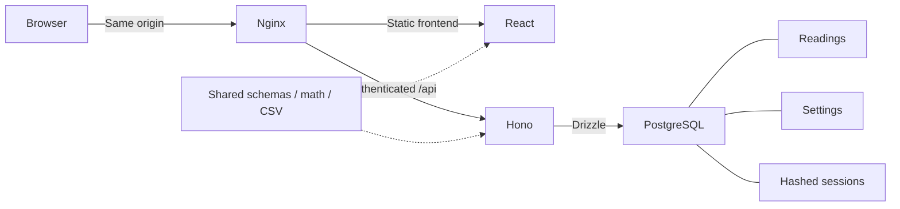

# MoonWeight portfolio kit

## Short description

MoonWeight is a private, self-hosted weight tracker with a calm lunar interface. It combines a responsive React dashboard, time-scaled charts, a secure Hono API, and PostgreSQL persistence into a small, complete product.

## Longer description

I built MoonWeight to keep personal tracking data on an owner-controlled server. The project covers the whole product: everyday entry flows, honest statistics for sparse data, canonical unit storage, reversible CSV transfer, revocable cookie sessions, schema migration, automated tests, and deployment through Docker and Nginx.

The public screenshots use a deterministic fictional dataset. No personal health history is part of the showcase.

## Technical highlights

- Preserved the original React/Vite + Hono + Drizzle architecture and improved its incomplete edges.
- Shared Zod contracts validate both forms and direct API calls.
- Calendar-date storage eliminates display-time timezone shifts; migration preserves the original timestamp for review.
- Canonical decimal kilograms and no-op edit preservation keep repeated display-unit changes from rewriting historical values.
- Deterministic stats expose actual baseline dates and decline unsupported sparse comparisons.
- CSV preview exposes rejected rows; atomic, serialized imports recheck exact duplicates without overwriting.
- Random session tokens are hashed in PostgreSQL; logout and secret rotation invalidate them, and restarts preserve active sessions.
- Transactional, checksum-checked migrations serialize startup and refuse edited migration history.
- Deployment tests caught and fixed workspace dependency packaging and internal-network development port behavior.
- Tests cover the product at four levels: pure/shared logic, API/component behavior, real database persistence, and desktop/mobile browser flows.

## Engineering decisions worth discussing

| Decision                                              | Reason                                                                                                     |
| ----------------------------------------------------- | ---------------------------------------------------------------------------------------------------------- |
| DATE for the reading; timestamps for audit fields     | A reading belongs to a calendar day, while creation/update are actual instants.                            |
| Allow multiple readings per day                       | Preserve original functionality and avoid destructive merging. Stable ordering defines “latest”.           |
| Three decimal places in canonical kg                  | Unit conversion gets a bounded, explicit storage precision. Display rounding never rewrites existing data. |
| Neutral change colors                                 | An increase or decrease is data, not an automatic judgment.                                                |
| Actual time axis and straight segments                | Sparse days remain visually honest; smoothing would imply unmeasured behavior.                             |
| Limited baseline tolerances                           | Weekly/monthly comparisons stay useful while declining very distant sparse observations.                   |
| Database sessions instead of signed stateless cookies | True logout revocation and restart persistence are useful for a private tracker.                           |
| Same-origin production serving                        | Smaller deployment surface, no external service requirements, and a restrictive CSP.                       |
| Empty-only seed                                       | Portfolio data can never silently replace an existing tracker.                                             |
| Tests in a unique temporary database                  | Real PostgreSQL behavior without resetting an existing tracker.                                            |

## Architecture



The production API and PostgreSQL ports are not public. An external reverse proxy supplies HTTPS for an internet-facing deployment.

## Screenshot checklist

Run an isolated empty tracker, seed it with fictional data, install Chromium, then run:

```sh
npm run portfolio:capture
```

| File                  | What it shows                                                                  |
| --------------------- | ------------------------------------------------------------------------------ |
| desktop-dashboard.png | 1440 × 1180 overview, current reading, honest stats, chart, entry form         |
| chart-target.png      | All-time chart, actual date spacing, target reference, first/latest comparison |
| history.png           | Notes, paging, and readable edit/delete actions                                |
| edit-reading.png      | Native modal edit form                                                         |
| mobile-dashboard.png  | 390px dashboard with the same product hierarchy                                |
| mobile-chart.png      | Chart controls and target on a small screen                                    |
| login.png             | Restrained lunar identity and private sign-in                                  |

The capture script checks for demo markers and rejects non-demo notes. Screenshots are direct browser captures, not generated mockups. It does not persist cookies or browser storage.

Manual alternatives: open localhost:5173, sign in, choose All time, use a 1440px desktop viewport or a 390px mobile viewport, and save the exact filenames above. Never capture a personal tracker.

## A 25-second demo

1. **0–5 seconds:** Open the fictional dashboard. Show the latest reading and baseline dates.
2. **5–10 seconds:** Switch from 30 days to All time. Point out the target line and real gaps between readings.
3. **10–15 seconds:** Add a fictional reading with a short note. Show the updated count and latest weight.
4. **15–21 seconds:** Edit it in history, then show the delete confirmation and remove it.
5. **21–25 seconds:** Open preferences, show kg/lb and the optional target, then sign out.

For a longer engineering demo, show CSV validation and the test suite. Keep all data fictional.

## Publication checklist

- Inspect the working-tree diff and make a reviewed release commit.
- Review historical commits before making the repository public: an earlier README contained a personal deployment address. History was intentionally preserved.
- Keep .env, database dumps, cookie/session files, and test artifacts out of Git.
- Verify that every screenshot contains only fictional data.
- Run the commands recorded in V1_RELEASE.md.
- Confirm hosted CI and your real HTTPS cookie/proxy behavior after deployment.
- Tag the reviewed commit v1.0.0 and attach the screenshots to the project page.
